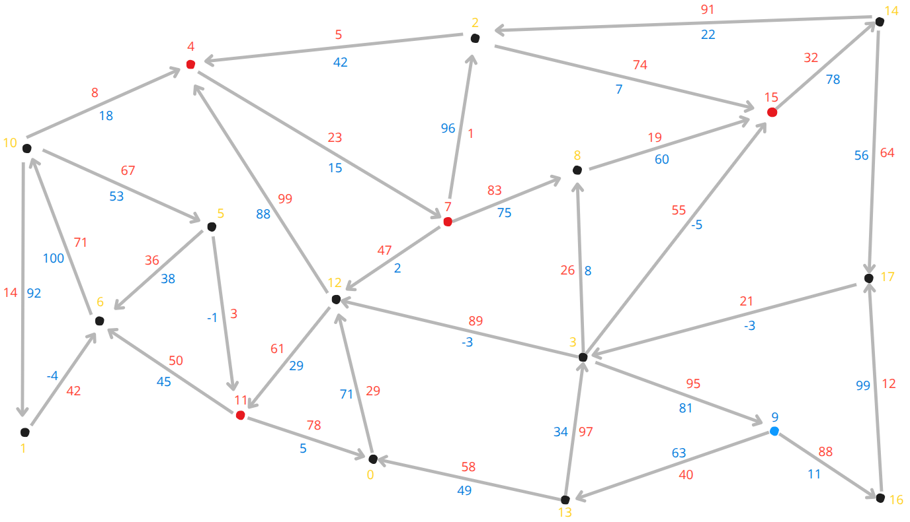

# Minimum paths

## 🧾 Credits

The problem was proposed in the MAC0323 class.

https://uspdigital.usp.br/jupiterweb/obterDisciplina?sgldis=MAC0323

**Note**: Other credits are mentioned in the Java files.

## 🔍 General Overview

This work, developed in Java, covers the following problem:

There are warriors and a robot spread across vertices of a graph. Given a certain vertex, all warriors must arrive there before the robot, who can walk through negative edges, and no paths mays intersect. In this context, the problem can be optimally solved by applying Dijkstra's algorithm considering each warrior's start as a node source and using Bellman-Ford's algorithm respective to the robot (the only one able to traverse negative edges).

**Note**: It's necessary to modify classic Dijkstra's algorithm to include the non-intersection constraint.

## 🗺️ Graph used
 

## ⚙️ How to run

- Compilation: javac Main.java
- Execution: java Main graph.txt

## 👤 Author

- Lucas Martins Próspero
